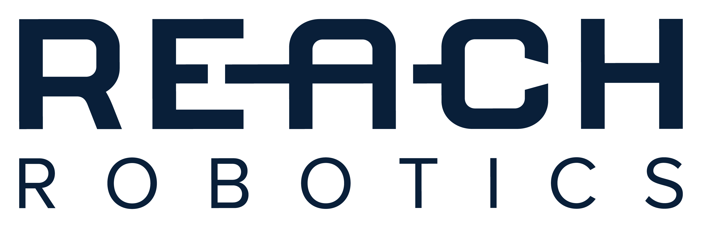
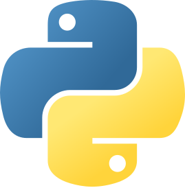

 

The Reach Robotics SDK provides the implementation of the Reach System Protocol [V1.12.1] in Python and C as well as a ROS 2 communication bridge. Additionally, the SDK provides some basic examples of how to use the Reach System Protocol to communicate with Reach Robotics hardware over serial and UDP connections. Follow the [instructions to get started](https://reach-robotics.github.io/reach_robotics_sdk/).

    
    
    
    

&nbsp;

> **Note:** Integration support is not included as part of this SDK. The software is supplied as-is, without warranty of any kind. Integration support may be purchased through one of Reach Robotics support packages. However, all services are subject to availability. For more information contact our sales team (sales@reachrobotics.com).

>Reach Robotics provides the following support options:
>- Python/C/C++ - 1 hour of engineering support included with any core or comprehensive support package.
>- ROS2 Foxy - paid-for support only for Alpha 5, Bravo 5 and Bravo 7 standard configurations.  

>The prices of supplementary support packages are dependent upon scope of request.

## Documentation

Detailed SDK documentation is available on our GitHub pages
https://reach-robotics.github.io/reach_robotics_sdk/. All Reach Robotics product documentation can be downloaded from our [website](https://reachrobotics.com/resources/knowledge-hub/?tab=datasheets-and-manuals/).

## License

Permission is hereby granted, free of charge, to any person obtaining a copy of this software and associated documentation files (the "Software"), limited exclusively to use with products produced by Reach Robotics Pty Ltd, subject to the following conditions:

1. The Software may only be used in conjunction with products manufactured or developed by Reach Robotics Pty Ltd.

2. Redistributions or use of the Software in any other context, including but not limited to, integration, combination, or use with other products or software, are strictly prohibited without prior written authorization from Reach Robotics Pty Ltd.

3. All copies of the Software, in whole or in part, must retain this notice and the above copyright notice.

THIS SOFTWARE IS PROVIDED "AS IS," WITHOUT WARRANTY OF ANY KIND, EXPRESS OR IMPLIED, INCLUDING BUT NOT LIMITED TO THE WARRANTIES OF MERCHANTABILITY, FITNESS FOR A PARTICULAR PURPOSE, AND NONINFRINGEMENT. IN NO EVENT SHALL REACH ROBOTICS PTY LTD BE LIABLE FOR ANY CLAIM, DAMAGES, OR OTHER LIABILITY, WHETHER IN AN ACTION OF CONTRACT, TORT, OR OTHERWISE, ARISING FROM, OUT OF, OR IN CONNECTION WITH THE SOFTWARE OR THE USE OR OTHER DEALINGS IN THE SOFTWARE.
