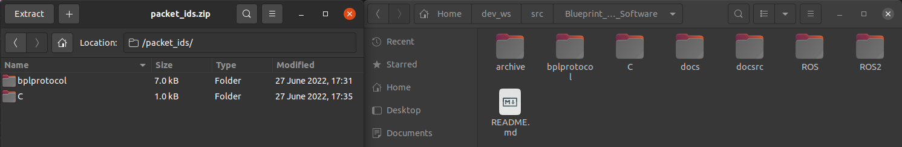

.. _getting_started:
    
Getting Started
========================

To get started with the Reach Robotics SDK, you'll first need to install 
the critical components package. This package includes our internal packet 
descriptions for the C and Python communication protocols. These packages 
are provided to customers who have purchased a PRO package for any Reach
Robotics product. For more information about PRO packages please contact 
our sales team (sales@reachrobotics.com). 

.. note::
    Some parts of this documentation and SDK source code refer to Blueprint Lab (bpl). 
    This is the former trading name of Reach Robotics.

Downloading the SDK
--------------------

Clone the SDK from the Reach Robotics GitHub into your development workspace,

.. code-block:: bash

   cd ~/workspace/src
   git clone https://github.com/Reach-Robotics/reach_robotics_sdk.git

.. note::
    If you intend to use the ROS or ROS 2 node, ensure the repository is 
    cloned into your ROS workspace src folder. 

Installing Critical Components
------------------------------

The SDK critical components can be download from the `Reach Robotics Website <https://reachrobotics.com/github-page/>`_.
Use the password provided to you at the time of your purchase or contact our `Sales Team <sales@reachrobotics.com/>`_ for 
more information.

.. image:: ../images/website_page.png
   :width: 600
   :align: center

Once downloaded, 

1. Open the ZIP File,

2. Copy the contents to the reach_robotics_sdk Folder,



3. Merge The folders if prompted.

When completed, the folder structure should look similar to the tree below,

.. code-block:: none

    reach_robotics_sdk
    └── bplprotocol
        │   └── bplprotocol
        │      └── packetID.py
        └── C
            └── packetID.h

Getting Started With Python
---------------------------

To get started with the Reach Robotics python protocol install the package ```bplprotocol```
locally,

.. code-block:: bash

   cd ./bplprotocol
   pip3 install .


.. note::
    If the package fails to install it is likely you have not installed the `Critical components <https://reachrobotics.com/github-page/>`_
    correctly. If this is the case, the following error will be raised during the installation ``"ImportError: Please install the Reach 
    Robotics SDK Critical Components``. 

Examples
~~~~~~~~
Some examples using the bplprotocol can be found under bplprotocol/examples,

.. toctree::
    :maxdepth: 1

    examples/requesting_joint_positions
    examples/setting_heartbeats
    examples/master_arm_passthrough
    examples/master_arm_information
    examples/force_torque_sensor
    examples/joint_control
    examples/simultaneous_joint_control
    examples/voltage_threshold_parameters

Getting Started With C/C++
---------------------------

To get started with the C/C++ communications protocol, ensure you have the files 
```bplprotocol.h``` and ```packetID.h``` in your file directory. 

Examples
~~~~~~~~~
Some examples using the bplprotocol can be found under C/examples,

.. toctree::
    :maxdepth: 1

    examples/encoding_packets
    examples/decoding_packets

Compilation and Execution
~~~~~~~~~~~~~~~~~~~~~~~~~~
You can compile and execute examples using the GCC tool chain as shown below. 

.. code-block:: bash

   cd ./C/examples/
   gcc decodePacketExample.c -I .. -o decode_example.o

   # To run the example
   ./decode_example.o