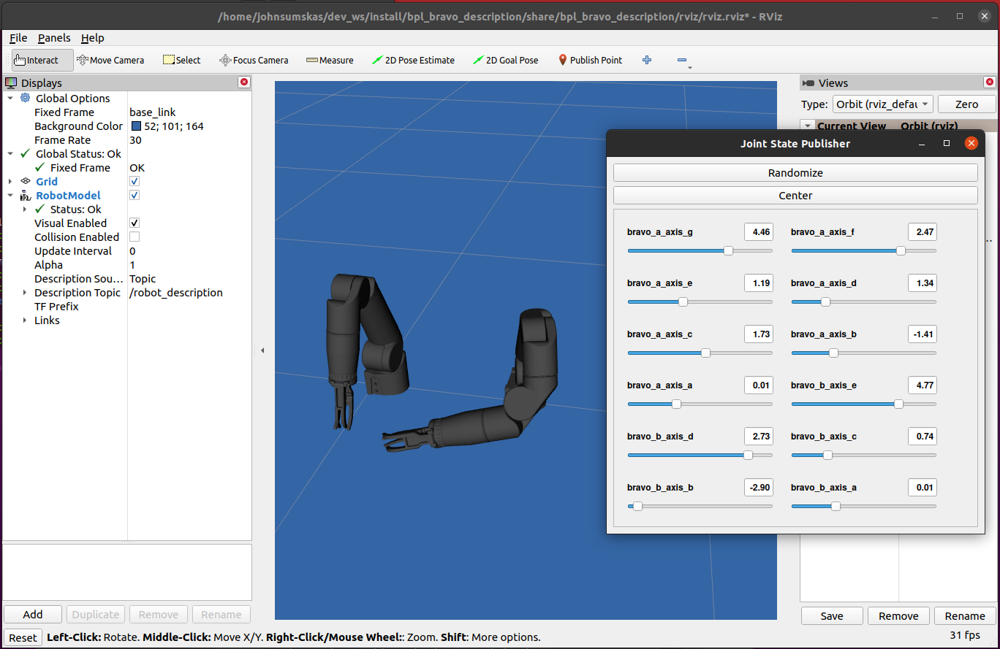

ROS 2
================================================
This tutorial assumes you have pre-installed ROS 2 for desktop on your computer. 
You can install ROS 2 by following the instructions at http://wiki.ros.org/ROS/Installation. 
Additionally, you'll need to install the Reach Robotics SDK and critical components. Instructions
for installation can found in the :ref:`Getting Started<getting_started>` section. 

Setup
---------------------

To get started, source the ROS 2 underlay, 

.. code-block:: bash

   source /opt/ros/foxy/setup.bash

.. note::
   It can be convenient to automatically source this script every time a new shell is launched. 

   .. code-block:: bash

      echo "source /opt/ros/foxy/setup.bash" >> ~/.bashrc
      source ~/.bashrc

   Keep in mind, if you have more than one ROS distribution installed, ~/.bashrc must only source 
   the setup.bash for the version you are currently using.
   
.. warning::
   Before building the colcon packages, you must remove the CATKIN_IGNORE file from the ROS 2 directory. 
   If this file is not removed, catkin_make will skip the ROS packages. Ensure that a COLCON_IGNORE
   file is present in the ROS directory, otherwise there will be conflicting package names. 

build the ROS 2 packages,

.. code-block:: bash

    cd ~/workspace
    colcon build

source the ROS 2 overlay packages,

.. code-block:: bash

   source ~/workspace/install/local_setup.bash

At this point the Reach Robotics nodes have been built and are ready to use. 

.. note::
   If you are using a ROS 2 distribution other than foxy you'll need to modify the source 
   command accordingly i.e. ```source /opt/ros/humble/setup.bash```

Packages
---------------------------
The ROS 2 folder is split into several packages. Each package is briefly described below.

bpl_passthrough
^^^^^^^^^^^^^^^^^^^^^^^^
The BPL passthrough is the core package that facilitates communication to Reach 
Robotics products. This passthrough converts ROS 2 messages into Serial or UDP
packets that can be read by the connected product. Each node in the passthrough 
uses :code:`bpl_msgs/Packet` for messaging. The packet construct is defined as, 
 
.. code-block::

   uint8 device_id
   uint8 packet_id
   uint8[] data

where, ``device_id`` is the device identifier, ``packet_id`` is the packet identifier, and 
``data`` is a list of 8 bit integers representing the data to be sent. To launch the 
passthrough run,

.. tabs::

    .. tab:: Serial

         .. code-block:: bash

            ros2 run bpl_passthrough serial_passthrough --ros-args -p serial_port:=/dev/ttyUSB0

         where,

         * :code:`serial_port` (string) - Serial Port to connect to the arm (Defaults to "/dev/ttyUSB0")
         * :code:`baudrate` (int) - Baudrate port of the serial connection. (Defaults to 115200)
            
    .. tab:: UDP

         .. code-block:: bash

            ros2 run bpl_passthrough udp_passthrough --ros-args -p ip_address:=192.168.2.4 port:=6789
         
         where,

         * :code:`ip_address` (string) - IP Address of the arm. (Defaults to 192.168.2.3)
         * :code:`port` (int) - UDP Port of the arm. (Defaults to 6789)

For both passthrough nodes the published topic, and subscribed topic are,

* :code:`/rx` (:code:`bpl_msgs/Packet`) - Received Packets from the manipulator
* :code:`/tx` (:code:`bpl_msgs/Packet`) - Packets that will be sent to the manipulator

respectively. 

Examples
"""""""""
This example demonstrates how to request read joint positions from joints on a manipulator.
To launch this example run the launch file. 

.. tabs::

    .. tab:: Serial

        .. code-block:: bash

            ros2 launch bpl_passthrough serial_passthrough_example.launch.py serial_port:="/dev/ttyUSB0"
            
    .. tab:: UDP

        .. code-block:: bash

            ros2 launch bpl_passthrough udp_passthrough_example.launch.py ip_address:=192.168.2.4 port:=6789

The script communicates the to passthrough node via the :code:`/tx` and :code:`/rx` topics.
It publishes request packets to the :code:`/tx` topic at a set frequency.
It subscribes the to :code:`/rx` topic and listens for positions packets.

.. note::
    This script has been tested to work at 400 Hz over a UDP Connection to the Base MCU.

bpl_bravo_description
^^^^^^^^^^^^^^^^^^^^^^^^
BPL Bravo Description package contains the Universal Robot description File (URDF) files for the bravo range of manipulators.

Supported Products:

- RB-7002 - Reach Bravo 7 (PRO)
- RB-5002 - Reach Bravo 5 (PRO)

Examples
""""""""""

Examples on viewing URDFs in RVIZ.



Viewing a Bravo 7 URDF,

.. code-block:: bash

   ros2 launch bpl_bravo_description view_bravo_7.launch.py

Viewing a Bravo 5 URDF,

.. code-block:: bash

   ros2 launch bpl_bravo_description view_bravo_5.launch.py

Viewing a Bravo 5 and Bravo 7 URDF,

.. code-block:: bash

   ros2 launch bpl_bravo_description view_bravo_double.launch.py


.. bpl_control
.. ^^^^^^^^^^^^^^^^^^^^^^^^^^^^^^^^^^^^^^^^^^^^^^^^^^^^^^^^^^^^^^^^^^^^^^^^^^^^
.. The BPL Control is a package that provides control and feedback for a manipulator.

.. .. note::
..    The BPL Control Nodes are intended for use with a full duplex connection. (I.e not intended for use over 485 Serial)


.. joint_state_publisher
.. """"""""""""""""""""""""""""""""""""""""
.. The Joint state publisher node will request and publish the corresponding joint states (position/velocity) to ROS. The 
.. published topics of ``joint_state_publisher`` are,

.. * :code:`joints_states` (:code:`sensor_msgs/JointState`) - Joint State of the manipulator.
.. * :code:`tx` (:code:`bpl_msgs/Packet`) - Packets to be sent to the manipulator.

.. and the subscribed topics are,

.. * :code:`rx` (:code:`bpl_msgs/Packet`) - Packets to be received from the manipulator

.. with parameters,

.. * :code:`joints` (List) - List of the Joint Device IDs of the manipulator.
.. * :code:`joint_names` (List) - List of the corresponding Joint Names of the manipulator.
.. * :code:`request_frequency` (Float) - Frequency to request the joint positions from the manipulator (default: :code:`10`).
.. * :code:`publish_frequency` (Float) - Frequency to publish the joint state of the manipulator (default: :code:`10`).

.. end_effector_pose_publisher
.. """""""""""""""""""""""""""""""""""""""""""
.. The end effector pose publisher node will request the end effector pose from the manipulator and publish it to ROS. The 
.. published topics of ``end_effector_pose_publisher`` are,

.. * :code:`end_effector_pose` (:code:`geometry_msgs/PoseStamped`) - End effector pose of the manipulator.
.. * :code:`tx` (:code:`bpl_msgs/Packet`) - Packets to send the the manipulator.

.. and the subscribed topics are,

.. * :code:`rx` (:code:`bpl_msgs/Packet`) - Packets to receive from the manipulator.

.. with parameters,

.. * :code:`frame_id` (String) - TF Frame ID of the maniulator base (default: :code:`bravo_base_link`).
.. * :code:`frequency` (Float) - Frequency to Request / Publish the end effector pose (default: :code:`20`)

.. control_node
.. """""""""""""""""""""""""""""
.. The BPL Control Node provides control of the manipulator. Control options include,

.. * Joint Velocity Control
.. * Joint Position Control
.. * End Effector Pose Control

.. The published topics of ``end_effector_pose_publisher`` are,

.. * :code:`tx` (:code:`bpl_msgs/Packet`) - Packets to send to the manipulator.

.. and the subscribed topics are,

.. * :code:`control/`

.. Bravo 5 Example
.. """""""""""""""""""""""

.. .. image:: ../images/bravo_5_bringup.png
..    :width: 600

.. The launch file connects to a Bravo 5 over UDP and presents a live view on RVIZ.
.. It also presents a visualisation of the current end effector pose.

.. .. code-block:: bash

..    ros2 launch bpl_bringup bravo_5_udp.launch.py ip_address:=192.168.2.4 port:=6789

.. Bravo 7 Example
.. """""""""""""""""""""""

.. .. image:: ../images/bravo_7_bringup.png
..    :width: 600
   
.. The launch file connects to a Bravo 7 over UDP and presents a live view on RVIZ.
.. It also presents a visualisation of the current end effector pose.

.. .. code-block:: bash

..    ros2 launch bpl_bringup bravo_7_udp.launch.py ip_address:=192.168.2.4 port:=6789

.. Bravo 7 and Bravo 5 Example
.. """""""""""""""""""""""""""""""""""""""

.. .. image:: ../images/bravo_double_bringup.png
..    :width: 600
   
.. The launch file connects to a both a Bravo 7 and Bravo 5 over UDP and presents a live view on RVIZ.
.. It also presents a visualisation of the current end effector poses of the manipulator.

.. .. code-block:: bash

..    ros2 launch bpl_bringup bravo_double_udp_launch.py ip_address_a:=192.168.2.4 port_a:=6789 ip_address_b:=192.168.2.8 port_b:=6789
